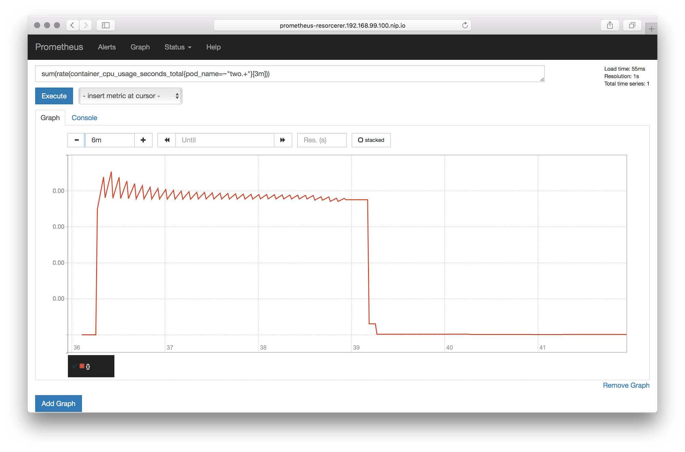

# resorcerer—resource sorcerer

_Do you know how much memory your app consumes? How about CPU time? What about spikes in the traffic?
Are you still manually managing the memory and CPU constraints per container?
Or, maybe you're not even yet there; maybe this whole resource consumption and constraints thing is
totally new to you. Read on._

- [What's this about and why should I care?](#whats-this-about-and-why-should-i-care)
- [Goals and non-goals of resorcerer](#goals-and-non-goals-of-resorcerer)
- [Setup](#setup)
	- [Launch Prometheus](#launch-prometheus)
	- [Launch resorcerer](#launch-resorcerer)
	- [Development](#development)
- [Usage](#usage)
- [Architecture](#architecture)

## What's this about and why should I care?

Let's see what Kubernetes practitioners have to say on this topic:

> Unfortunately, Kubernetes has not yet implemented dynamic resource management, which is why we have to set resource limits for our containers. I imagine that at some point Kubernetes will start implementing a less manual way to manage resources, but this is all we have for now.

Ben Visser, 12/2016, [Kubernetes - Understanding Resources](http://www.noqcks.io/note/kubernetes-resources-limits/)

> Kubernetes doesn’t have dynamic resource allocation, which means that requests and limits have to be determined and set by the user. When these numbers are not known precisely for a service, a good approach is to start it with overestimated resources requests and no limit, then let it run under normal production load for a certain time: hours, days, weeks according to the nature of the service. This time should be long enough to let you collect enough metrics and be able to determine correct values with a small margin of error.

Antoine Cotten, 05/2016, [1 year, lessons learned from a 0 to Kubernetes transition](https://acotten.com/post/1year-kubernetes)

Now, turns out that Google's internal resource consumption stats collector & predictor—called `autopilot`—does in fact offer this automatic resource consumption tracking and management.
As the wise Tim Hockin stated in his KubeCon 2016 talk on 'Everything You Ever Wanted To Know About Resource Scheduling' (see [slides](https://speakerdeck.com/thockin/everything-you-ever-wanted-to-know-about-resource-scheduling-dot-dot-dot-almost) | [video](https://www.youtube.com/watch?v=nWGkvrIPqJ4)):

> Some 2/3 of the Borg users depend on autopilot.

Already in mid 2015 the Kubernetes community—informed by Google's `autopilot` experience—raised this [issue](https://github.com/kubernetes/kubernetes/issues/10782), and in early 2017 we got a proposal and now initial work on the resulting [Vertical Pod Autoscaler](https://github.com/kubernetes/autoscaler/tree/master/vertical-pod-autoscaler) (VPA).

## Goals and non-goals of resorcerer

With `resorcerer` we want to contribute to the advancement of VPAs. It's a prototypical implementation allowing users to learn more about their resource consumption footprint. It is an opinionated implementation, making a number of assumptions:

1. Prometheus is available in the cluster.
1. You can run `resorcerer` in privileged mode as it needs access to all necessary metrics.
1. As much as possible should happen automatically—that's where the magic/sorcerer comes into play ;)

For convenience, I've put together a simple way to deploy `resorcerer` along with Prometheus into OpenShift (see the **Setup** section),
however, `resorcerer` itself will work on any Kubernetes cluster.

## Setup

The following assumes OpenShift 1.5 or later.

### Launch Prometheus

Following the nice tutorial by [Robust Perception](https://www.robustperception.io/openshift-and-prometheus/)
we set up our Prometheus environment as follows (or you simply launch `deployments/promup.sh` which includes the following steps):

```
$ oc new-project resorcerer
$ oc create configmap prom-config-cm --from-file=deployments/prometheus.yaml
$ oc apply -f deployments/all-prometheus.yaml
$ oc expose service prometheus
$ oc get routes
NAME                HOST/PORT                                     PATH      SERVICES     PORT       TERMINATION   WILDCARD
routes/prometheus   prometheus-resorcerer.192.168.99.100.nip.io             prometheus   9090-tcp                 None
```

From the `oc routes` output above you see where your Prometheus dashboard is, `http://prometheus-resorcerer.192.168.99.100.nip.io/graph`
for me (since I'm using Minishift for development):



If you're not familiar with the Prometheus [query language](https://prometheus.io/docs/querying/basics/), now is a good time to learn it.
Also, to verify the setup you might want to use `curl http://prometheus-resorcerer.192.168.99.100.nip.io/api/v1/targets`;
see also this example of a [targets JSON](dev/example-targets.json) result file.

### Launch resorcerer

In a nutshell, `resorcerer` is a namespace-level infrastructure daemon that you can ask to observe pods and get recommendations for the resource consumption.

Launch `resorcerer` as follows (note: in vanilla Kubernetes, replace the `oc apply` with `kubectl apply`, if on OpenShift then simple run `deployments/resorcererup.sh`):

```
$ oc apply -f deployments/all-resorcerer.yaml
```

If you're using OpenShift as the target deployment platform you can also do the following to make the `resorcerer` HTTP API
accessible from outside of the cluster:

```
$ oc expose deployment resorcerer --port=8080
$ oc expose service resorcerer
```

You might also want to deploy a couple of apps so that you can try out various pods.
If you want an on-ramp for that, simply use `deployments/genworkload.sh` to populate the cluster with some pods you can use.

When done, don't forgot to clean up with `oc delete project resorcerer`, which will remove all the resources including the project/namespace itself.

### Development

The `resorcerer` daemon is shipped as a container, that is, we don't do binary releases.
If you want to extend `resorcerer`, you'll need at least Go 1.8 as well as [dep](https://github.com/golang/dep)
to build it. Note that if you don't have `dep` installed, do `go get -u github.com/golang/dep/cmd/dep` now to install it
and then `dep ensure` to install the dependencies. The result is an additional `vendor/` directory.

Now you can use the Makefile to build the binaries and container image as you see fit, for example:

```
$ go build      # build binary for your platform, for local testing
$ make release  # cut a new release (only maintainers, requires push access to quay.io)
```

Note that when you execute the `resorcerer` binary locally, for development purposes, you want to set
something like `export PROM_API=http://prometheus-resorcerer.192.168.99.100.nip.io` to let it know where
to find Prometheus.

## Usage

Explains how to use the `resorcerer` HTTP API.

### HTTP API

The following is against a base URL `$RESORCERER`—something like `http://resorcerer-resorcerer.192.168.99.100.nip.io`)—and operating in the default `resorcerer` namespace. You can perform the operations as described in the following.

#### Observation

To observe $CONTAINER in $POD for period $PERIOD (with valid time units "s", "m", and "h") do:

```
GET /observation/$POD/$CONTAINER?period=$PERIOD
```

For example:

```
$ http $RESORCERER/observation/nginx/nginx?period=1h
HTTP/1.1 200 OK

Successfully observed container 'nginx' in pod 'nginx'
```

#### Recommendations

To get a resource consumption recommendation for $CONTAINER in $POD do:

```
GET /recommendation/$POD/$CONTAINER
```

For example:

```
$ http $RESORCERER/recommendation/nginx/nginx
HTTP/1.1 200 OK

{
    "container": "nginx",
    "pod": "nginx",
    "resources": {
        "cpu": "0.00387342659078205",
        "mem": "9109504"
    }
}
```

#### Adjustments

To adjust the resource consumption for $CONTAINER in $POD do:

```
$ http POST /adjustment/$POD/$CONTAINER cpu=$CPUSEC mem=$MEMINBYTES
```

Note that above means effectively manipulating `spec.containers[].resources.limits/requests` and causing a new pod being launched.
There are ATM no in-place adjustments possible since the primitives are not in place yet, cf. [ISSUE-5774](https://github.com/kubernetes/kubernetes/issues/5774).

Also, note the following (tested for K8S 1.5):

- the minimum CPU seconds limit allowed is `1 millicore`, that is, the minimum `$CPUSEC` you can set is `0.001`.
- the minimum memory limit allowed is `4MB`, , that is, the minimum `$MEMINBYTES` you can set is `4000000`.

Note that `resorcerer` enforces those minimum limits, that is, even if you try to set lower limits they will be ignored and above limits will be used in their place.

For example:

```
$ http POST $RESORCERER/adjustment/nginx/nginx cpu=0.01 mem=5000000
HTTP/1.1 200 OK

Pod 'nginx' is supervised by 'Deployment/RS' - now updated it with new resource limits
```

## Architecture


TBD

### PromQL examples

Aggregate CPU usage for all containers in pod `twocontainers` over the last 5 minutes:

```
sum(rate(container_cpu_usage_seconds_total{pod_name="twocontainers"}[5m]))
```

Aggregate CPU usage for pods that names start with `simple` over the last 3 minutes:

```
sum(rate(container_cpu_usage_seconds_total{pod_name=~"simple.+", container_name="POD"}[3m])) without (cpu)
```

Maximum value memory usage in bytes over the last 5 minutes for container `sise` in pod `twocontainers`:

```
max_over_time(container_memory_usage_bytes{pod_name="twocontainers", container_name="sise"}[5m])
```

The 99 percentile of the cumulative CPU time consumed for CPU30 in seconds over the last 60 seconds:

```
quantile_over_time(0.99,container_cpu_usage_seconds_total{cpu="cpu30"}[60s])
```

Average Resident Set Size (RSS), excl. swapped out memory:

```
avg(container_memory_rss)
```

The 5 largest RSS entries:

```
topk(5,container_memory_rss)
```

## Resources

- [Hands on: Monitoring Kubernetes with Prometheus](https://coreos.com/blog/monitoring-kubernetes-with-prometheus.html)
- [Monitoring Kubernetes with Prometheus (Kubernetes Ireland, 2016)](https://www.slideshare.net/brianbrazil/monitoring-kubernetes-with-prometheus-kubernetes-ireland-2016)
- [Kubernetes service discovery](https://prometheus.io/docs/operating/configuration/#<kubernetes_sd_config>) configuration parameters (Prometheus docs)
- [metrics cAdvisor](https://github.com/google/cadvisor/blob/master/metrics/prometheus.go) source_labels
- [Prometheus Ops Metrics Example](https://github.com/openshift/origin/tree/master/examples/prometheus) from `openshift/origin`
- [wkulhanek/openshift-prometheus](https://github.com/wkulhanek/openshift-prometheus)
- [waynedovey/openshift-prometheus](https://github.com/waynedovey/openshift-prometheus)

## Kudos

We'd like to thank the following people for their support:

- Julius Volz (Prometheus)
- Stefan Schimanski (Kube API)
