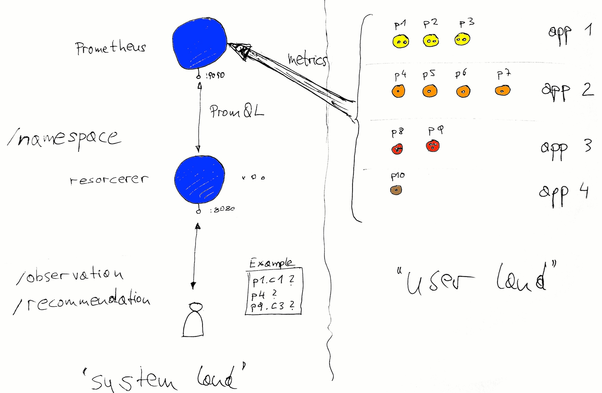

# resorcerer—resource sorcerer

_Do you know how much memory your app consumes? How about CPU time? What about spikes in the traffic?
Are you still manually managing the memory and CPU constraints per container?
Or, maybe you're not even yet there; maybe this whole resource consumption and constraints thing is
totally new to you. Read on._

- [What's this about and why should I care?](#whats-this-about-and-why-should-i-care)
- [Goals and non-goals of resorcerer](#goals-and-non-goals-of-resorcerer)
- [Setup](#setup)
	- [Launch cAdvisor and Prometheus](#launch-cadvisor-and-prometheus)
	- [Launch resorcerer](#launch-resorcerer)
	- [Development](#development)
- [Usage](#usage)
- [Architecture](#architecture)

## What's this about and why should I care?

Let's see what Kubernetes practitioners have to say on this topic:

> Unfortunately, Kubernetes has not yet implemented dynamic resource management, which is why we have to set resource limits for our containers. I imagine that at some point Kubernetes will start implementing a less manual way to manage resources, but this is all we have for now.

Ben Visser, 12/2016, [Kubernetes - Understanding Resources](http://www.noqcks.io/note/kubernetes-resources-limits/)

> Kubernetes doesn’t have dynamic resource allocation, which means that requests and limits have to be determined and set by the user. When these numbers are not known precisely for a service, a good approach is to start it with overestimated resources requests and no limit, then let it run under normal production load for a certain time: hours, days, weeks according to the nature of the service. This time should be long enough to let you collect enough metrics and be able to determine correct values with a small margin of error.

Antoine Cotten, 05/2016, [1 year, lessons learned from a 0 to Kubernetes transition](https://acotten.com/post/1year-kubernetes)

Now, turns out that Google's internal resource consumption stats collector & predictor—called `autopilot`—does in fact offer this automatic resource consumption tracking and management.
As the wise Tim Hockin stated in his KubeCon 2016 talk on 'Everything You Ever Wanted To Know About Resource Scheduling' (see [slides](https://speakerdeck.com/thockin/everything-you-ever-wanted-to-know-about-resource-scheduling-dot-dot-dot-almost) | [video](https://www.youtube.com/watch?v=nWGkvrIPqJ4)):

> Some 2/3 of the Borg users depend on autopilot.

Already in mid 2015 the Kubernetes community—informed by Google's `autopilot` experience—raised this [issue](https://github.com/kubernetes/kubernetes/issues/10782), and in early 2017 we got a proposal and now initial work on the resulting [Vertical Pod Autoscaler](https://github.com/kubernetes/autoscaler/tree/master/vertical-pod-autoscaler) (VPA).

## Goals and non-goals of resorcerer

With `resorcerer` we want to contribute to the advancement of VPAs. It's a prototypical implementation allowing users to learn more about their resource consumption footprint. It is an opinionated implementation, making a number of assumptions:

1. Prometheus is available in the cluster.
1. You can run `resorcerer` in privileged mode as it needs access to all necessary metrics.
1. As much as possible should happen automatically—that's where the magic/sorcerer comes into play ;)

For convenience, I've put together a simple way to deploy `resorcerer` along with Prometheus into OpenShift (see the **Setup** section),
however, `resorcerer` itself will work on any Kubernetes cluster.

## Setup

The following assumes OpenShift 1.5 or later.

### Launch cAdvisor and Prometheus

Following the nice tutorial by [Robust Perception](https://www.robustperception.io/openshift-and-prometheus/)
we set up our Prometheus environment as follows (or you simply launch `deployments/promup.sh` which includes the following steps):

```
$ oc new-project resorcerer
$ oc apply -f deployments/all-cadvisor.yaml
$ oc create configmap prom-config-cm --from-file=deployments/prometheus.yaml
$ oc apply -f deployments/all-prometheus.yaml
$ oc expose service cadvisor
$ oc expose service prometheus

$ oc get routes,svc,dc
NAME                HOST/PORT                                     PATH      SERVICES     PORT       TERMINATION   WILDCARD
routes/cadvisor     cadvisor-resorcerer.192.168.99.100.nip.io               cadvisor     8080-tcp                 None
routes/prometheus   prometheus-resorcerer.192.168.99.100.nip.io             prometheus   9090-tcp                 None

NAME             CLUSTER-IP       EXTERNAL-IP   PORT(S)    AGE
svc/cadvisor     172.30.88.229    <none>        8080/TCP   1m
svc/prometheus   172.30.114.121   <none>        9090/TCP   42s

NAME            REVISION   DESIRED   CURRENT   TRIGGERED BY
dc/cadvisor     1          1         1         config,image(cadvisor:latest)
dc/prometheus   1          1         1         config,image(prometheus:latest)
```

From the `oc routes` output above you see where your Prometheus dashboard is, `http://prometheus-resorcerer.192.168.99.100.nip.io/graph` for me (since I'm using Minishift for development).

NOTE: To make sure that both Prometheus and resorcerer can [access](https://docs.openshift.org/latest/admin_guide/service_accounts.html) all the metrics, do:

```
$ oc policy add-role-to-user admin system:serviceaccount:resorcerer:default
```

If you're not familiar with the Prometheus [query language](https://prometheus.io/docs/querying/basics/), now is a good time to learn it.
Also, to verify the setup you might want to use `curl http://prometheus-resorcerer.192.168.99.100.nip.io/api/v1/targets`;
see also this example of a [targets JSON](dev/example-targets.json) result file.

### Launch resorcerer

In a nutshell, `resorcerer` is an namespace-level infrastructure daemon that you can ask to observe pods and get recommendations for the resource consumption.

Launch `resorcerer` as follows (note: in vanilla Kubernetes, replace the `oc apply` with `kubectl apply`):

```
$ oc apply -f deployments/all-resorcerer.yaml
```

You might also want to deploy a couple of apps so that you can try out various pods.
If you want an on-ramp for that, simply use `deployments/genworkload.sh` to populate the cluster with some pods you can use.

When done, don't forgot to clean up with `oc delete project resorcerer`, which will remove all the resources including the project/namespace itself.

### Development

The `resorcerer` daemon is shipped as a container, that is, we don't do binary releases.
If you want to extend `resorcerer`, you'll need at least Go 1.8 as well as [dep](https://github.com/golang/dep)
to build it. Note that if you don't have `dep` installed, do `go get -u github.com/golang/dep/cmd/dep` now to install it
and then `dep ensure` to install the dependencies. The result is an additional `vendor/` directory.

Now you can use the Makefile to build the binaries and container image as you see fit, for example:

```
$ go build      # build binary for your platform, for local testing
$ make release  # cut a new release (only maintainers, requires push access to quay.io)
```

Note that when you execute the `resorcerer` binary locally, for development purposes, you want to set
something like `export PROM_API=http://prometheus-resorcerer.192.168.99.100.nip.io` to let it know where
to find Prometheus.


## Usage

### HTTP API

Against the base service `resorcerer:8080` (and assuming you've set the target namespace via `TARGET_NAMESPACE`):

```
GET /observation/$POD?period=10s --> observe $POD for 10s; valid time units: "s", "m", and "h"

GET /recommendation/$POD --> get a resource recommendation for $POD, something like:

{
    "name": "simpleservice",
    "recs": [
        {
            "name": "c1",
            "resources": {
                "cpu": "200m",
                "mem": 43758200
            }
        }
    ]
}

POST {"mem":250, "cpu":"100m"} /recommendation/$POD/c1 --> for container c1 in $POD set:
                                                           spec.containers['c1'].resources.limits/requests

```

## Architecture



TBD

### PromQL examples

CPU system time for all containers in the current namespace:

```
container_cpu_system_seconds_total{__meta_kubernetes_pod_container_name=".+"}
```

Average Resident Set Size (RSS), excl. swapped out memory:

```
avg(container_memory_rss)
```

Maximum value of current memory usage in bytes over the last 100 minutes:

```
max_over_time(container_memory_usage_bytes{}[100m])
```

The 99 percentile of the cumulative CPU time consumed for CPU30 in seconds over the last 60 seconds:

```
quantile_over_time(0.99,container_cpu_usage_seconds_total{cpu="cpu30"}[60s])
```

The 5 largest RSS entries:

```
topk(5,container_memory_rss)
```

## Resources

- [Hands on: Monitoring Kubernetes with Prometheus](https://coreos.com/blog/monitoring-kubernetes-with-prometheus.html)
- [Monitoring Kubernetes with Prometheus (Kubernetes Ireland, 2016)](https://www.slideshare.net/brianbrazil/monitoring-kubernetes-with-prometheus-kubernetes-ireland-2016)
- [Kubernetes service discovery](https://prometheus.io/docs/operating/configuration/#<kubernetes_sd_config>) configuration parameters (Prometheus docs)
- [metrics cAdvisor](https://github.com/google/cadvisor/blob/master/metrics/prometheus.go) source_labels
- [waynedovey/openshift-prometheus](https://github.com/waynedovey/openshift-prometheus)
